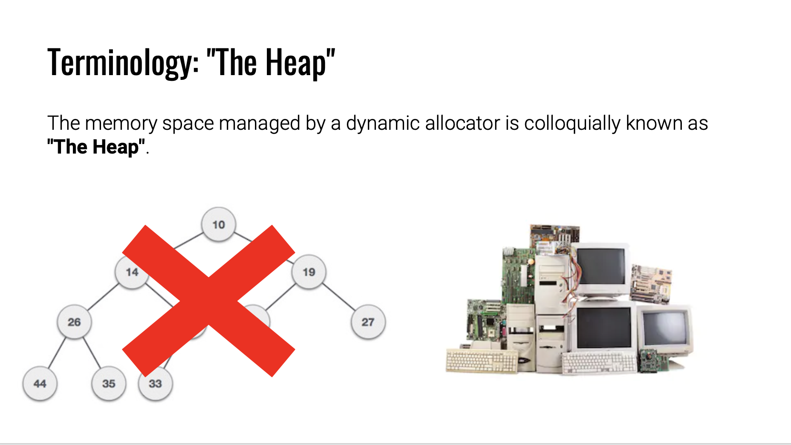
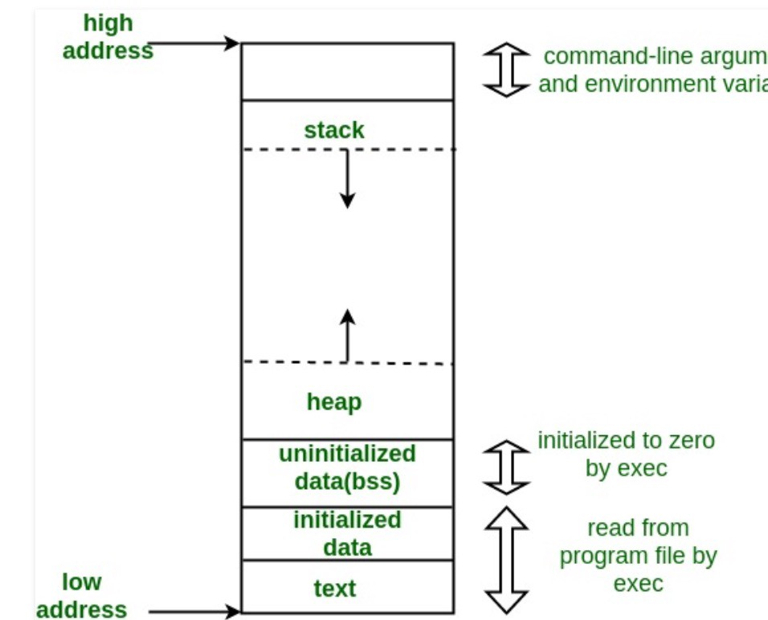

# Heap Overflow

### Difference Between Heap Data Structure And Linux Heap

&#x20;For heap data structure, it is a complete binary tree for data storage. For the Linux heap, it is just the space allocated by the Linux system, not a tree. These two conceptions are totally different.

### Linux Stack & Heap Works

First, we must know how the Linux stack and heap work in the memory. For stack, it grows from a high memory address to a low memory address. Oppositely, the heap grows from a low memory address to a high memory address.&#x20;

Stack space is allocated by Linux System automatically. Heap space is allocated by users themselves manually.&#x20;

Both stack and heap are continuous spaces.

### Malloc, Calloc, And Free

There are three functions related to heap allocation.

**malloc():**  malloc(size) function allocates a single "size" space for the heap.&#x20;

**calloc():**  calloc(size\_t nitems, size\_t size) function allocates "nitem" "size" spaces for the heap.&#x20;

The difference between malloc and calloc is 1. malloc only allocates a single size of memory. 2. calloc will reset all data to 0 when the system allocates the space but malloc will not.

**free():** Free() function will release the space allocated by malloc() or calloc(). When free() function is called, the space will be released but the data inside the free() will still remain until new data being written in that space.

### How Heap works

Suppose the hotel front desk helps you to check-in. There are several types of housing: one guest room, two guest room, a penthouse, etc. Guest A order a one-guest room and the room number is 403.   After living in 1 day, guest A checks out first at the front desk and leaves the hotel. Guest B later on checks in and asks whether there is a new room for him to live in. Because guest A just check out the 403 room, the front desk would let guest B to live in the 403.

But, a "heap" hotel is not a good hotel. It does not have a cleaner to clean the house. For guest B, he will see a really messy room and he has to clean it by himself. You may ask: why the hotel does not have a cleaning service? It is because the cleaning service is expensive! The hotel must hire a cleaner, buy cleaning devices and pay cleaner wages!

Similar to a "heap" hotel, the program uses functions to request space from memory. Once the program makes a request, the system will allocate a space to the program. The program uses free() when it does not need that space anymore. When the program needs the space again, the system will check whether there are some spaces that were being used previously. The program will allocate to the program the "old" spaces first and then when "old" spaces are all being used, the system will give the program the new spaces.

#### How Fastbin works

Fastbin is the subset of the bin in the heap. For fastbin, when 

